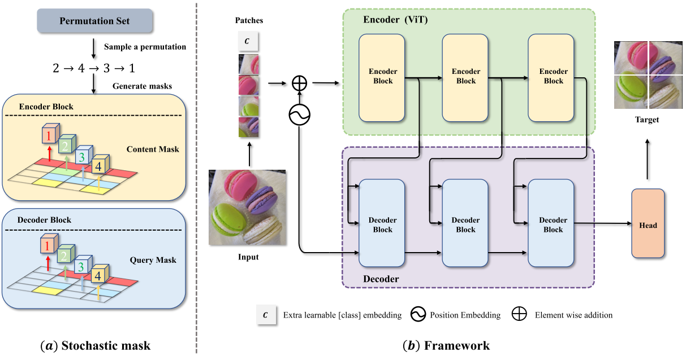
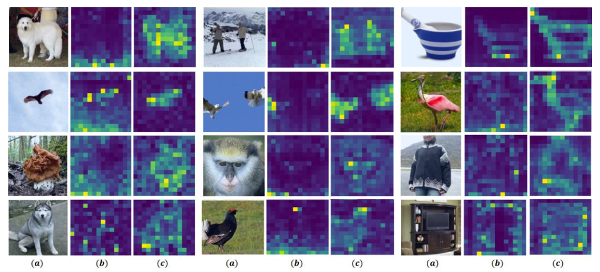

# SAIM
Official PyTorch Implementation of [Exploring Stochastic Autoregressive Image Modeling for Visual Representation](https://arxiv.org/abs/2212.01610), Accepted by AAAI 2023.
## Introduction


**SAIM** is a novel self-supervised pre-training framework that performs autoregressive image modeling with stochastic permutation strategy. Our method significantly improves the performance of autoregressive image modeling and achieves the best accuracy (83.9%) on the vanilla ViT-Base model among methods
using only ImageNet-1K data.

## Main Results on ImageNet-1k

The following table provides pretrained checkpoints and logs used in the paper.

|                        | SAIM-Base                                                    |
| ---------------------- | ------------------------------------------------------------ |
| pretrained checkpoints | [download](https://drive.google.com/file/d/1qdK8lwcJp0hE8v3NoKZ4LcqzGFOxq0Ra/view?usp=sharing) |
| logs                   | [download](https://drive.google.com/file/d/1zdrphjiBWtnbfSfv6IkUDYlvUmy4uh-A/view?usp=sharing) |

The results of Finetune and Linear probing on ImageNet-1k are as following:

|  Models  | Architecture | Pretrain Epochs | FT acc@1(%) | LIN acc@1(%) |                       FT logs/weights                        |                       LIN logs/weights                       |
| :------: | :----------: | :-------------: | :---------: | :----------: | :----------------------------------------------------------: | :----------------------------------------------------------: |
|   BEiT   |    ViT-B     |       800       |    83.2     |     37.6     |                              -                               |                              -                               |
|   MAE    |    ViT-B     |      1600       |    83.6     |     67.8     |                              -                               |                              -                               |
|  SimMIM  |    ViT-B     |      1600       |    83.8     |     56.7     |                              -                               |                              -                               |
|   iGPT   |    iGPT-L    |        -        |    72.6     |     65.2     |                              -                               |                              -                               |
| ViT-iGPT |    ViT-B     |       300       |    82.7     |     20.4     |                              -                               |                              -                               |
|   SAIM   |    ViT-B     |       300       |    83.6     |     58.5     |                              -                               |                              -                               |
|   SAIM   |    ViT-B     |       800       |  **83.9**   |     62.5     | [log](https://drive.google.com/file/d/124S-vLd30A-xRLndVIdnXY5WVTJHx9mu/view?usp=sharing)/[weight](https://drive.google.com/file/d/1-XjhgIY0uLDLH6U5lWZ3sbLcJqdeVhkr/view?usp=sharing) | [log](https://drive.google.com/file/d/1X6WhwtyNSWwVajrX21Ij4ifQvZ3gyLX4/view?usp=sharing)/[weight](https://drive.google.com/file/d/1ZqK_2D7hEJcp7RsT1KQyokRWgh2kBbgn/view?usp=sharing) |

## Getting Started

### Install
- Clone this repo:

```bash
git clone https://github.com/qiy20/SAIM
cd SAIM
```

- Create a conda environment and activate it:
```bash
conda create -n saim python=3.9
conda activate saim
```

- Install `Pytorch==1.13.0` and `torchvision==0.14.0` with `CUDA==11.6`

```bash
conda install pytorch torchvision torchaudio pytorch-cuda=11.6 -c pytorch -c nvidia
```

- Install `timm==0.4.5`

```bash
pip install timm==0.4.5
```

### Data preparation

You can download the ImageNet-1K [here](https://image-net.org) and prepare the ImageNet-1K follow this format:
```tree data
imagenet
  ├── train
  │   ├── class1
  │   │   ├── img1.jpeg
  │   │   ├── img2.jpeg
  │   │   └── ...
  │   ├── class2
  │   │   ├── img3.jpeg
  │   │   └── ...
  │   └── ...
  └── val
      ├── class1
      │   ├── img4.jpeg
      │   ├── img5.jpeg
      │   └── ...
      ├── class2
      │   ├── img6.jpeg
      │   └── ...
      └── ...
```

### Pretrain
```shell
python -m torch.distributed.launch --nproc_per_node 32 main_pretrain.py \
    --batch_size 64 --epochs 800 \
    --model saim_base --query_depth 12 --prediction_head_type MLP \
    --gaussian_kernel_size 9 --gaussian_sigma 1 --norm_pix_loss \
    --blr 2e-4 --warmup_epochs 30 --weight_decay 0.5 \
    --data_path <imagenet-path> --output_dir <output-directory>
```
### Finetune
```shell
python -m torch.distributed.launch --nproc_per_node 32 main_finetune.py \
    --model vit_base_patch16 --cls_token --batch_size 32 \
    --blr 5e-4 --layer_decay 0.65 --epochs 100 --warmup_epochs 20 \
    --weight_decay 0.05 --drop_path 0.1 --reprob 0.25 --mixup 0.8 --cutmix 1.0 \
    --dist_eval --data_path <imagenet-path> \
    --finetune <pretrained-ckpt> --output_dir <output-directory>
```
### Linear Probing
```shell
python -m torch.distributed.launch --nproc_per_node 32 main_linprobe.py \
    --model vit_base_patch16 --cls_token --batch_size 64 \
    --blr 0.1 --epochs 90 --warmup_epochs 0 --weight_decay 0.0 \
    --dist_eval --data_path <imagenet-path> \
    --finetune <pretrained-ckpt> --output_dir <output-directory>
```
## Visualization



We show example results for ImageNet validation set. Description of images from left to right: **(a)** the original image, **(b)** the attention map of ViT-iGPT, **(c)** the attention map of SAIM. SAIM focuses on the main information of the image, and obtains human-level attention representation with unlabeled data.

## Acknowledgement

The pretraining and finetuning of our project are based on [DeiT](https://github.com/facebookresearch/deit) , [BEiT](https://github.com/microsoft/unilm/tree/master/beit) and [MAE](https://github.com/facebookresearch/mae).

## LICENSE

SAIM is released under the [MIT License](./LICENSE).

## Citation

```
@inproceedings{qi2023exploring,
  title={Exploring Stochastic Autoregressive Image Modeling for Visual Representation},
  author={Qi, Yu and Yang, Fan and Zhu, Yousong and Liu, Yufei and Wu, Liwei and Zhao, Rui and Li, Wei},
  booktitle={Proceedings of the AAAI Conference on Artificial Intelligence},
  volume={37},
  number={2},
  pages={2074--2081},
  year={2023}
}
```

